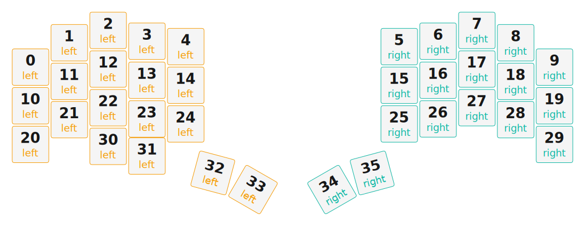

# ZMK Configuration for cosmoskeyboard

*Generated by Shield Wizard for ZMK*



Download compiled firmware from the Actions tab. <https://zmk.dev/docs/user-setup#installing-the-firmware>

Edit your keymap <https://zmk.dev/docs/keymaps>.
User keymap is located at [`config/cosmoskeyboard.keymap`](config/cosmoskeyboard.keymap).

-----

<details>
<summary>
Shield Wizard Debug Information
</summary>

In case of broken configuration, here is the Shield Wizard internal data used to generate this configuration:

Commit: 5840d41ac0915092c8fe45da617ffb4bb91e1b97

```json
{"name":"cosmoskeyboard","shield":"cosmoskeyboard","dongle":false,"modules":["badjeff/pmw3610"],"layout":[{"id":"01KQ9KQB0FRYSHE4528ASFRH3D","part":0,"row":0,"col":0,"w":1,"h":1,"x":0,"y":0.95,"r":0,"rx":0,"ry":0},{"id":"01KQ9KQB0FAK64JMZ1E1V6SFG8","part":0,"row":0,"col":1,"w":1,"h":1,"x":1,"y":0.32,"r":0,"rx":0,"ry":0},{"id":"01KQ9KQB0F8AY9GWPN9CFZPEE0","part":0,"row":0,"col":2,"w":1,"h":1,"x":2,"y":0,"r":0,"rx":0,"ry":0},{"id":"01KQ9KQB0FQ3KV2PMRNPTDBT3N","part":0,"row":0,"col":3,"w":1,"h":1,"x":3,"y":0.28,"r":0,"rx":0,"ry":0},{"id":"01KQ9KQB0FPGPSEF7P9S7F1D78","part":0,"row":0,"col":4,"w":1,"h":1,"x":4,"y":0.42,"r":0,"rx":0,"ry":0},{"id":"01KQ9KQB0F0K6YA992XP3F30T2","part":1,"row":0,"col":5,"w":1,"h":1,"x":9.5,"y":0.42,"r":0,"rx":0,"ry":0},{"id":"01KQ9KQB0F878PFAMS4ZKTFTYY","part":1,"row":0,"col":6,"w":1,"h":1,"x":10.5,"y":0.28,"r":0,"rx":0,"ry":0},{"id":"01KQ9KQB0F6W1YJYEPPSXMP344","part":1,"row":0,"col":7,"w":1,"h":1,"x":11.5,"y":0,"r":0,"rx":0,"ry":0},{"id":"01KQ9KQB0FQ74T0TENJM3Z8P5G","part":1,"row":0,"col":8,"w":1,"h":1,"x":12.5,"y":0.32,"r":0,"rx":0,"ry":0},{"id":"01KQ9KQB0FENJN3566SGGNGM5K","part":1,"row":0,"col":9,"w":1,"h":1,"x":13.5,"y":0.95,"r":0,"rx":0,"ry":0},{"id":"01KQ9KQB0F92X7CDDX9KBY9XK8","part":0,"row":1,"col":0,"w":1,"h":1,"x":0,"y":1.95,"r":0,"rx":0,"ry":0},{"id":"01KQ9KQB0F53J2N2RGKER7QDMD","part":0,"row":1,"col":1,"w":1,"h":1,"x":1,"y":1.32,"r":0,"rx":0,"ry":0},{"id":"01KQ9KQB0FNVGK0RE35725W7VA","part":0,"row":1,"col":2,"w":1,"h":1,"x":2,"y":1,"r":0,"rx":0,"ry":0},{"id":"01KQ9KQB0GZYNQFFFCM5AVK70P","part":0,"row":1,"col":3,"w":1,"h":1,"x":3,"y":1.29,"r":0,"rx":0,"ry":0},{"id":"01KQ9KQB0GPWMK42ESKJHMZY04","part":0,"row":1,"col":4,"w":1,"h":1,"x":4,"y":1.42,"r":0,"rx":0,"ry":0},{"id":"01KQ9KQB0GP300C847T9PGVBMD","part":1,"row":1,"col":5,"w":1,"h":1,"x":9.5,"y":1.42,"r":0,"rx":0,"ry":0},{"id":"01KQ9KQB0GYM5SYMX4G4Y07TEE","part":1,"row":1,"col":6,"w":1,"h":1,"x":10.5,"y":1.29,"r":0,"rx":0,"ry":0},{"id":"01KQ9KQB0GWSYNAQADX1N5JH6J","part":1,"row":1,"col":7,"w":1,"h":1,"x":11.5,"y":1,"r":0,"rx":0,"ry":0},{"id":"01KQ9KQB0GA2MSY1RGHV61KYNW","part":1,"row":1,"col":8,"w":1,"h":1,"x":12.5,"y":1.32,"r":0,"rx":0,"ry":0},{"id":"01KQ9KQB0G67B403046K4Y01WR","part":1,"row":1,"col":9,"w":1,"h":1,"x":13.5,"y":1.95,"r":0,"rx":0,"ry":0},{"id":"01KQ9KQB0G9SYPVAQ8R6JS68X7","part":0,"row":2,"col":0,"w":1,"h":1,"x":0,"y":2.95,"r":0,"rx":0,"ry":0},{"id":"01KQ9KQB0G96TFXNT2KSD41TXH","part":0,"row":2,"col":1,"w":1,"h":1,"x":1,"y":2.31,"r":0,"rx":0,"ry":0},{"id":"01KQ9KQB0GY9T19308G8YW5SX8","part":0,"row":2,"col":2,"w":1,"h":1,"x":2,"y":2,"r":0,"rx":0,"ry":0},{"id":"01KQ9KQB0G1M5XCZKGQ8GDGYJR","part":0,"row":2,"col":3,"w":1,"h":1,"x":3,"y":2.29,"r":0,"rx":0,"ry":0},{"id":"01KQ9KQB0G5H3XPEE3HSZREXKM","part":0,"row":2,"col":4,"w":1,"h":1,"x":4,"y":2.42,"r":0,"rx":0,"ry":0},{"id":"01KQ9KQB0GMTEY8V7C2TZ3357H","part":1,"row":2,"col":5,"w":1,"h":1,"x":9.5,"y":2.42,"r":0,"rx":0,"ry":0},{"id":"01KQ9KQB0GGZ4JM9NBGGMS3Q9B","part":1,"row":2,"col":6,"w":1,"h":1,"x":10.5,"y":2.29,"r":0,"rx":0,"ry":0},{"id":"01KQ9KQB0GM0H53J4SJE6CKM00","part":1,"row":2,"col":7,"w":1,"h":1,"x":11.5,"y":2,"r":0,"rx":0,"ry":0},{"id":"01KQ9KQB0G2S69PDWTB26CSEMJ","part":1,"row":2,"col":8,"w":1,"h":1,"x":12.5,"y":2.31,"r":0,"rx":0,"ry":0},{"id":"01KQ9KQB0GN7BDR1PC5W6PFC12","part":1,"row":2,"col":9,"w":1,"h":1,"x":13.5,"y":2.95,"r":0,"rx":0,"ry":0},{"id":"01KQ9KSBVTNJZX1S4AGTQ7Z5TX","part":0,"row":3,"col":1,"w":1,"h":1,"x":2,"y":3,"r":0,"rx":0,"ry":0},{"id":"01KQ9KSE80QGP3ACS1219F5ZQY","part":0,"row":3,"col":2,"w":1,"h":1,"x":3,"y":3.25,"r":0,"rx":0,"ry":0},{"id":"01KQ9KQB0GY8TJDYJ5318XK98H","part":0,"row":3,"col":3,"w":1,"h":1,"x":4.55,"y":3.8,"r":15,"rx":5.55,"ry":4.8},{"id":"01KQ9KQB0GHW46G9S5PV2V12KE","part":0,"row":3,"col":4,"w":1,"h":1,"x":5.55,"y":3.8,"r":30,"rx":5.55,"ry":4.8},{"id":"01KQ9KQB0G9A43VRNZ19ZMKR57","part":1,"row":3,"col":5,"w":1,"h":1,"x":7.95,"y":3.8,"r":-30,"rx":8.95,"ry":4.8},{"id":"01KQ9KQB0GD168JASJ4YVB7Q99","part":1,"row":3,"col":6,"w":1,"h":1,"x":8.95,"y":3.8,"r":-15,"rx":8.95,"ry":4.8}],"parts":[{"name":"left","controller":"nice_nano_v2","wiring":"matrix_diode","pins":{"d9":"output","d8":"output","d7":"output","d6":"output","d5":"output","d10":"input","d16":"input","d14":"input","d15":"input"},"keys":{"01KQ9KQB0FPGPSEF7P9S7F1D78":{"input":"d15","output":"d9"},"01KQ9KQB0GPWMK42ESKJHMZY04":{"input":"d14","output":"d9"},"01KQ9KQB0G5H3XPEE3HSZREXKM":{"input":"d16","output":"d9"},"01KQ9KQB0GHW46G9S5PV2V12KE":{"input":"d10","output":"d9"},"01KQ9KQB0FQ3KV2PMRNPTDBT3N":{"input":"d15","output":"d8"},"01KQ9KQB0GZYNQFFFCM5AVK70P":{"input":"d14","output":"d8"},"01KQ9KQB0G1M5XCZKGQ8GDGYJR":{"input":"d16","output":"d8"},"01KQ9KQB0GY8TJDYJ5318XK98H":{"input":"d10","output":"d8"},"01KQ9KQB0F8AY9GWPN9CFZPEE0":{"input":"d15","output":"d7"},"01KQ9KQB0FNVGK0RE35725W7VA":{"input":"d14","output":"d7"},"01KQ9KQB0GY9T19308G8YW5SX8":{"input":"d16","output":"d7"},"01KQ9KSE80QGP3ACS1219F5ZQY":{"input":"d10","output":"d7"},"01KQ9KQB0FAK64JMZ1E1V6SFG8":{"input":"d15","output":"d6"},"01KQ9KQB0F53J2N2RGKER7QDMD":{"input":"d14","output":"d6"},"01KQ9KQB0G96TFXNT2KSD41TXH":{"input":"d16","output":"d6"},"01KQ9KSBVTNJZX1S4AGTQ7Z5TX":{"input":"d10","output":"d6"},"01KQ9KQB0FRYSHE4528ASFRH3D":{"input":"d15","output":"d5"},"01KQ9KQB0F92X7CDDX9KBY9XK8":{"input":"d14","output":"d5"},"01KQ9KQB0G9SYPVAQ8R6JS68X7":{"input":"d16","output":"d5"}},"encoders":[],"buses":[{"name":"spi0","devices":[],"type":"spi"},{"name":"spi1","devices":[],"type":"spi"},{"name":"spi2","devices":[],"type":"spi"},{"name":"spi3","devices":[],"type":"spi"},{"name":"i2c0","devices":[],"type":"i2c"},{"name":"i2c1","devices":[],"type":"i2c"}]},{"name":"right","controller":"nice_nano_v2","wiring":"matrix_diode","pins":{"d9":"output","d8":"output","d7":"output","d6":"output","d5":"output","d10":"input","d16":"input","d14":"input","d15":"input","d2":"bus","d0":"bus","d3":"bus","d1":"bus"},"keys":{"01KQ9KQB0GN7BDR1PC5W6PFC12":{"input":"d16","output":"d9"},"01KQ9KQB0G67B403046K4Y01WR":{"input":"d14","output":"d9"},"01KQ9KQB0FENJN3566SGGNGM5K":{"input":"d15","output":"d9"},"01KQ9KQB0G2S69PDWTB26CSEMJ":{"input":"d16","output":"d8"},"01KQ9KQB0GA2MSY1RGHV61KYNW":{"input":"d14","output":"d8"},"01KQ9KQB0FQ74T0TENJM3Z8P5G":{"input":"d15","output":"d8"},"01KQ9KQB0GM0H53J4SJE6CKM00":{"input":"d16","output":"d7"},"01KQ9KQB0GWSYNAQADX1N5JH6J":{"input":"d14","output":"d7"},"01KQ9KQB0F6W1YJYEPPSXMP344":{"input":"d15","output":"d7"},"01KQ9KQB0GD168JASJ4YVB7Q99":{"input":"d10","output":"d6"},"01KQ9KQB0GGZ4JM9NBGGMS3Q9B":{"input":"d16","output":"d6"},"01KQ9KQB0GYM5SYMX4G4Y07TEE":{"input":"d14","output":"d6"},"01KQ9KQB0F878PFAMS4ZKTFTYY":{"input":"d15","output":"d6"},"01KQ9KQB0G9A43VRNZ19ZMKR57":{"input":"d10","output":"d5"},"01KQ9KQB0GMTEY8V7C2TZ3357H":{"input":"d16","output":"d5"},"01KQ9KQB0GP300C847T9PGVBMD":{"input":"d14","output":"d5"},"01KQ9KQB0F0K6YA992XP3F30T2":{"input":"d15","output":"d5"}},"encoders":[],"buses":[{"name":"spi0","devices":[{"type":"pmw3610","cs":"d3","irq":"d1","cpi":600,"swapxy":false,"invertx":false,"inverty":false}],"type":"spi","mosi":"d2","miso":"d2","sck":"d0"},{"name":"spi1","devices":[],"type":"spi"},{"name":"spi2","devices":[],"type":"spi"},{"name":"spi3","devices":[],"type":"spi"},{"name":"i2c0","devices":[],"type":"i2c"},{"name":"i2c1","devices":[],"type":"i2c"}]}]}
```

</details>
